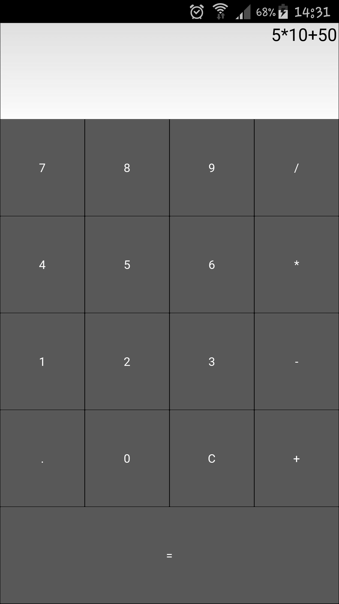

#KivyCalc

#### An Android Application.

#### By **{Vincent Muya}**

## Description

A calculator application.

## Setup and Installation
Cone or download the repo. The next step is to connect your Android phone to your computer and copy the apk file to it. Then you can open the file browser on your phone and click on the apk file. Android should ask you if you’d like to install the application. You may see a warning since the app was downloaded from outside Google Play, but you should still be able to install it.

Here’s the calculator running on Android 

## Known Bugs

No known bugs.

## Technologies Used

-Python
-Kivy
-Buildozer

## Support and contact details

vincentmuya13@gmail.com

### License

Copyright (c) {2020} **{Vincent Muya}**
